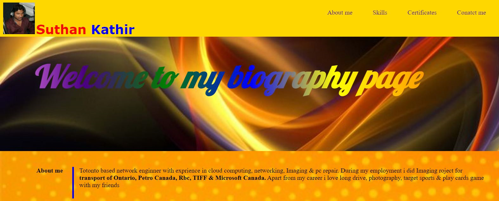
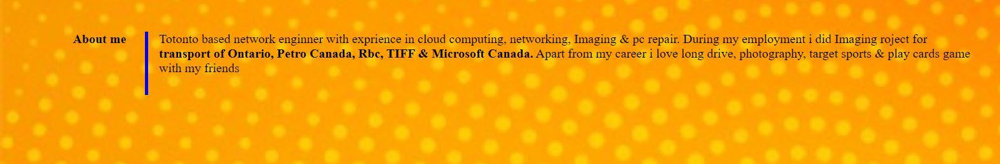
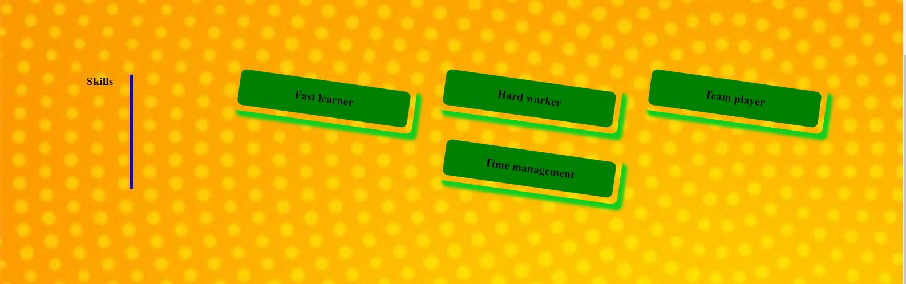

This is about my bio project

Title is Bio

here is the link for my bio page  [Bio](https://www.google.com)

HTMl 
1. Header - Contain  pic , name and & navigation
  

2. About me- i discribe little bit about my experience, projects and my likes 
  

3. Skills - i discribe few of my skills 
   

4. Certification - i posted required certification for my job
   

5. Conatact me - I include my phone no , email id & git hub link
   

6. Footer - Copy right & design by
    

    CSS

    In header Section I use span to give two colours to my name. It contain navigation item and link to each page

    welcome section have a background pic and text "Welcome to my biography page " i use mutilcolortext class to give rainbow colors to text , transparent colour and font styling

    in about me section i use float left , rightside boarder style & padding 

    Skills section i use flex styling and transform, shadow for class="sktext"

    in certification and contact me section also i use flex styling

    i use media screen to response to varies screen size

 Dry code in CSS 

   --blue:blue;
  --red:red;
  --gold:gold;
  --inline:inline;
  --center: center;
  --float:left;
  --margin-top: 100px;
  --padding: 10px;
  --width:100%;
  --width10: 10%;
  --text-align: right;

